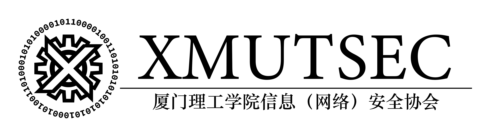

# XMUTSEC

**厦门理工学院信息安全协会（XMUTSEC）** - 成立于二〇一六年陆月九日是计算机学院指导下的学术科技类社团，几位志同道合的少年人在鹭江之畔一拍即合成立了一支CTF战队CodeMonster与之同时诞生的还有圣后溪英兰德皇家幼儿园附属理工学院信息安全协会（厦门理工学院信息安全协会），协会主要研究的方向以安全类为主，此外，协会也会组织学生参加学术竞赛，举办学术交流等等。

协会官网：[https://www.xmutsec.cn](https://www.xmutsec.cn)

### 加入我们

加入标准
（满足以下两个条件即可，包括品行端正）
- 品行端正

- 对计算机安全有着浓厚的兴趣

- 对新事物有着强烈的探索欲望

- 能够完成我们出的新生赛题（校赛）

- 能独立解决一题大型CTF竞赛的题

- 高中自学算法或参加过算法竞赛

- 破解过某些软件

- 在CNVD、EDUSRC、HackerOne、补天、360、阿里云先知、或者在企业SRC（华为、腾讯、B站）发表文章或者挖
- 掘并提交漏洞报告

- 独自研究过可信技术、量子安全、人工智能安全、工业控制安全

- …或是其他任何和信息安全有关的事情。

#### 学习方式

- 线上自学

- 协会学习平台：https://cloud.xmutsec.cn

- 学习资料：https://ctf-wiki.github.io/ctf-wiki/

- 刷题

- 逛大佬们的博客

- 坚持

- 坚持

- 坚持

- 协会网盘里拥有学习网络安全的所有资料，大家可自行下载学习，如遇到困难可先自行解决（注意翻阅《提问的智慧》），解决不了的在向学长或学姐发起提问，理工信息安全协会欢迎全校同学的到来，协会每学期会举办一场网络空间安全大赛，用于战队选拔，获得奖项的同学即可加入XMUTSEC或CodeMonster战队，参与学术竞赛和